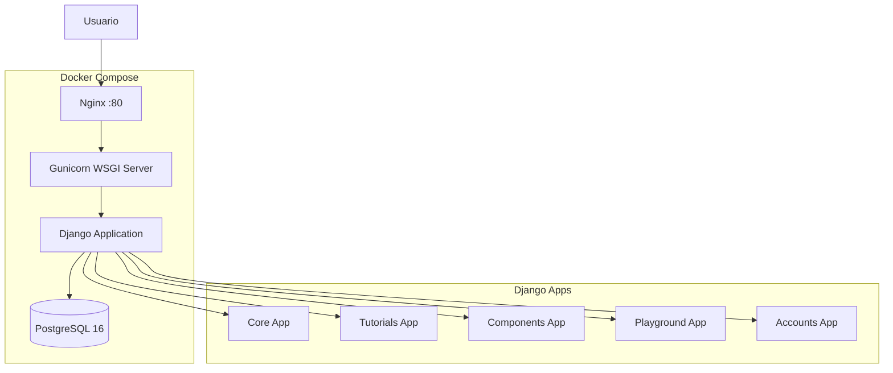
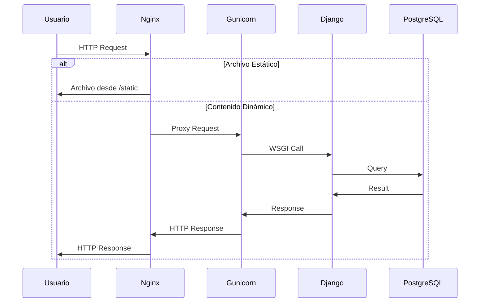
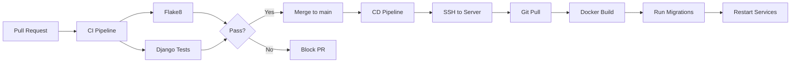
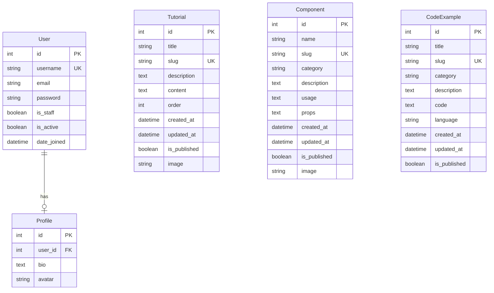

# Design Document: Reflex Documentation Django Project

## Overview

El sistema es una aplicación web Django completa para documentación y aprendizaje del framework Reflex. La arquitectura sigue el patrón MVT (Model-View-Template) de Django con una estructura modular de 5 apps independientes, cada una con responsabilidades claramente definadas.

El sistema está diseñado para ser desplegado mediante contenedores Docker, con soporte completo para desarrollo local y producción. La base de datos PostgreSQL 16 proporciona persistencia robusta, mientras que Nginx actúa como reverse proxy en producción para servir archivos estáticos eficientemente.

Los pipelines CI/CD automatizados garantizan calidad del código mediante linting y testing en cada pull request, y despliegan automáticamente los cambios a producción cuando se fusionan a la rama main.

### Objetivos de Diseño

1. **Modularidad**: Separación clara de responsabilidades mediante apps Django independientes
2. **Portabilidad**: Contenedorización completa para entornos reproducibles
3. **Escalabilidad**: Arquitectura preparada para crecimiento de contenido y usuarios
4. **Mantenibilidad**: Código limpio con testing automatizado y linting
5. **Seguridad**: Gestión de secretos mediante variables de entorno

## Architecture

### Arquitectura de Alto Nivel



### Arquitectura de Aplicaciones Django

El proyecto sigue una arquitectura modular con 5 apps Django:

1. **Core App**: Gestiona páginas principales, navegación y contenido estático general
2. **Tutorials App**: Gestiona tutoriales paso a paso almacenados en base de datos
3. **Components App**: Gestiona documentación de referencia de componentes Reflex
4. **Playground App**: Gestiona ejemplos de código con resaltado de sintaxis
5. **Accounts App**: Gestiona registro, autenticación y perfiles de usuario

Cada app sigue la estructura estándar de Django:
- `models.py`: Definición de modelos de datos
- `views.py`: Lógica de presentación
- `urls.py`: Configuración de rutas
- `admin.py`: Registro en panel de administración
- `templates/`: Plantillas HTML específicas de la app

### Arquitectura de Contenedores

**Desarrollo Local:**
- Contenedor `web`: Django development server con hot reload
- Contenedor `db`: PostgreSQL 16
- Volúmenes: código fuente montado, datos PostgreSQL persistentes

**Producción:**
- Contenedor `web`: Gunicorn + Django
- Contenedor `nginx`: Reverse proxy y servidor de archivos estáticos
- Contenedor `db`: PostgreSQL 16
- Volúmenes: archivos estáticos compartidos, datos PostgreSQL persistentes

### Flujo de Datos



### Pipelines CI/CD



## Components and Interfaces

### Componentes Principales

#### 1. Django Configuration (config/)

**Responsabilidad**: Configuración central del proyecto Django

**Archivos clave**:
- `settings.py`: Configuración principal (base de datos, apps, middleware, internacionalización)
- `urls.py`: Enrutamiento principal que incluye URLs de cada app
- `wsgi.py`: Punto de entrada WSGI para producción

**Configuración de Base de Datos**:
```python
DATABASES = {
    'default': {
        'ENGINE': 'django.db.backends.postgresql',
        'NAME': config('DB_NAME'),
        'USER': config('DB_USER'),
        'PASSWORD': config('DB_PASSWORD'),
        'HOST': config('DB_HOST'),
        'PORT': config('DB_PORT'),
    }
}
```

**Configuración Regional**:
- `LANGUAGE_CODE = 'es-es'`
- `TIME_ZONE = 'Europe/Madrid'`
- `USE_I18N = True`
- `USE_TZ = True`

#### 2. Core App

**Responsabilidad**: Páginas principales y navegación del sitio

**Modelos**: Ninguno (o modelos auxiliares para configuración del sitio)

**Vistas**:
- `HomeView`: Página de inicio
- `AboutView`: Página "Acerca de"
- Vistas para páginas estáticas generales

**URLs**:
- `/`: Página de inicio
- `/about/`: Acerca de

**Templates**:
- `base.html`: Template base con navegación
- `home.html`: Página de inicio
- `about.html`: Página acerca de

#### 3. Tutorials App

**Responsabilidad**: Gestión de tutoriales paso a paso

**Modelos**:
- `Tutorial`: Representa un tutorial completo
  - `title`: CharField
  - `slug`: SlugField (único)
  - `description`: TextField
  - `content`: TextField (contenido Markdown o HTML)
  - `order`: IntegerField (para ordenamiento)
  - `created_at`: DateTimeField
  - `updated_at`: DateTimeField
  - `is_published`: BooleanField
  - `image`: ImageField (opcional)

**Vistas**:
- `TutorialListView`: Lista todos los tutoriales publicados
- `TutorialDetailView`: Muestra detalle de un tutorial

**URLs**:
- `/tutorials/`: Lista de tutoriales
- `/tutorials/<slug>/`: Detalle de tutorial

#### 4. Components App

**Responsabilidad**: Documentación de referencia de componentes Reflex

**Modelos**:
- `Component`: Representa un componente de Reflex
  - `name`: CharField
  - `slug`: SlugField (único)
  - `category`: CharField (choices: UI, Layout, Forms, etc.)
  - `description`: TextField
  - `usage`: TextField (ejemplo de uso)
  - `props`: TextField (documentación de props)
  - `created_at`: DateTimeField
  - `updated_at`: DateTimeField
  - `is_published`: BooleanField
  - `image`: ImageField (opcional)

**Vistas**:
- `ComponentListView`: Lista todos los componentes publicados
- `ComponentDetailView`: Muestra detalle de un componente

**URLs**:
- `/components/`: Lista de componentes
- `/components/<slug>/`: Detalle de componente

#### 5. Playground App

**Responsabilidad**: Ejemplos de código interactivos

**Modelos**:
- `CodeExample`: Representa un ejemplo de código
  - `title`: CharField
  - `slug`: SlugField (único)
  - `category`: CharField (choices: Básico, Intermedio, Avanzado)
  - `description`: TextField
  - `code`: TextField (código fuente)
  - `language`: CharField (default: 'python')
  - `created_at`: DateTimeField
  - `updated_at`: DateTimeField
  - `is_published`: BooleanField

**Vistas**:
- `ExampleListView`: Lista ejemplos por categoría
- `ExampleDetailView`: Muestra ejemplo con resaltado de sintaxis

**URLs**:
- `/playground/`: Lista de ejemplos
- `/playground/<slug>/`: Detalle de ejemplo

**Integración con highlight.js**:
- Templates incluyen highlight.js desde CDN
- Código se renderiza en bloques `<pre><code class="language-python">`
- JavaScript inicializa highlight.js en carga de página

#### 6. Accounts App

**Responsabilidad**: Gestión de usuarios y autenticación

**Modelos**:
- Utiliza el modelo `User` de Django (`django.contrib.auth.models.User`)
- `Profile` (opcional): Extiende User con información adicional
  - `user`: OneToOneField(User)
  - `bio`: TextField
  - `avatar`: ImageField (opcional)

**Vistas**:
- `RegisterView`: Registro de nuevos usuarios
- `LoginView`: Autenticación de usuarios (puede usar vista built-in de Django)
- `LogoutView`: Cierre de sesión (puede usar vista built-in de Django)
- `ProfileView`: Ver perfil de usuario
- `ProfileEditView`: Editar perfil de usuario

**URLs**:
- `/accounts/register/`: Registro
- `/accounts/login/`: Login
- `/accounts/logout/`: Logout
- `/accounts/profile/`: Ver perfil
- `/accounts/profile/edit/`: Editar perfil

#### 7. Admin Panel

**Responsabilidad**: Gestión de contenido por administradores

**Configuración**:
- Todos los modelos registrados en sus respectivos `admin.py`
- Personalización de list_display, search_fields, list_filter
- Acceso en `/admin/`

**Modelos Registrados**:
- Tutorial (con filtros por is_published, created_at)
- Component (con filtros por category, is_published)
- CodeExample (con filtros por category, is_published)
- Profile (si existe)

### Interfaces Externas

#### 1. PostgreSQL Database

**Conexión**: psycopg2-binary
**Puerto**: 5432
**Credenciales**: Variables de entorno (DB_NAME, DB_USER, DB_PASSWORD, DB_HOST, DB_PORT)

#### 2. Nginx Reverse Proxy

**Puerto**: 80 (producción)
**Configuración**:
- Proxy pass a Gunicorn en puerto 8000
- Servir archivos estáticos desde `/static`
- Timeouts configurados para requests largos

#### 3. CDN Resources

**TailwindCSS**: Incluido desde CDN para estilos
**highlight.js**: Incluido desde CDN para resaltado de sintaxis

#### 4. GitHub Actions

**CI Pipeline**: Trigger en pull requests a main/develop
**CD Pipeline**: Trigger en push a main
**Secrets requeridos**: SERVER_HOST, SERVER_USER, SERVER_SSH_KEY

## Data Models

### Diagrama de Entidad-Relación



### Modelo Tutorial

**Propósito**: Almacenar tutoriales paso a paso para aprender Reflex

**Campos**:
- `id`: AutoField (PK)
- `title`: CharField(max_length=200) - Título del tutorial
- `slug`: SlugField(unique=True) - URL-friendly identifier
- `description`: TextField - Descripción breve
- `content`: TextField - Contenido completo (Markdown/HTML)
- `order`: IntegerField(default=0) - Orden de presentación
- `created_at`: DateTimeField(auto_now_add=True)
- `updated_at`: DateTimeField(auto_now=True)
- `is_published`: BooleanField(default=False)
- `image`: ImageField(upload_to='tutorials/', blank=True, null=True)

**Métodos**:
- `__str__()`: Retorna title
- `get_absolute_url()`: Retorna URL del detalle

**Meta**:
- `ordering = ['order', 'created_at']`
- `verbose_name_plural = 'Tutorials'`

### Modelo Component

**Propósito**: Almacenar documentación de componentes de Reflex

**Campos**:
- `id`: AutoField (PK)
- `name`: CharField(max_length=100) - Nombre del componente
- `slug`: SlugField(unique=True)
- `category`: CharField(max_length=50, choices=CATEGORY_CHOICES)
  - Choices: UI, Layout, Forms, Data Display, Navigation, Feedback
- `description`: TextField - Descripción del componente
- `usage`: TextField - Ejemplo de uso
- `props`: TextField - Documentación de propiedades
- `created_at`: DateTimeField(auto_now_add=True)
- `updated_at`: DateTimeField(auto_now=True)
- `is_published`: BooleanField(default=False)
- `image`: ImageField(upload_to='components/', blank=True, null=True)

**Métodos**:
- `__str__()`: Retorna name
- `get_absolute_url()`: Retorna URL del detalle

**Meta**:
- `ordering = ['category', 'name']`
- `verbose_name_plural = 'Components'`

### Modelo CodeExample

**Propósito**: Almacenar ejemplos de código para el playground

**Campos**:
- `id`: AutoField (PK)
- `title`: CharField(max_length=200) - Título del ejemplo
- `slug`: SlugField(unique=True)
- `category`: CharField(max_length=50, choices=CATEGORY_CHOICES)
  - Choices: Básico, Intermedio, Avanzado
- `description`: TextField - Descripción del ejemplo
- `code`: TextField - Código fuente
- `language`: CharField(max_length=20, default='python')
- `created_at`: DateTimeField(auto_now_add=True)
- `updated_at`: DateTimeField(auto_now=True)
- `is_published`: BooleanField(default=False)

**Métodos**:
- `__str__()`: Retorna title
- `get_absolute_url()`: Retorna URL del detalle

**Meta**:
- `ordering = ['category', 'created_at']`
- `verbose_name_plural = 'Code Examples'`

### Modelo Profile

**Propósito**: Extender el modelo User con información adicional

**Campos**:
- `id`: AutoField (PK)
- `user`: OneToOneField(User, on_delete=CASCADE)
- `bio`: TextField(blank=True)
- `avatar`: ImageField(upload_to='avatars/', blank=True, null=True)

**Métodos**:
- `__str__()`: Retorna user.username

**Signals**:
- `post_save` en User: Crear Profile automáticamente al crear User

### Modelo User (Django Built-in)

**Propósito**: Gestión de usuarios y autenticación

**Campos principales**:
- `username`: CharField(unique=True)
- `email`: EmailField
- `password`: CharField (hasheado)
- `is_staff`: BooleanField - Acceso al admin
- `is_active`: BooleanField - Cuenta activa
- `date_joined`: DateTimeField

**Nota**: Se utiliza el modelo User estándar de Django sin modificaciones

### Consideraciones de Datos

**Migraciones**:
- Todas las apps tienen su propio directorio `migrations/`
- Migraciones se ejecutan automáticamente en producción mediante script de inicio
- En desarrollo se ejecutan manualmente con `python manage.py migrate`

**Fixtures** (opcional):
- Datos de ejemplo para desarrollo en `fixtures/` de cada app
- Carga con `python manage.py loaddata <fixture_name>`

**Validaciones**:
- Slugs únicos para URLs amigables
- Validación de campos requeridos a nivel de modelo
- Validación adicional en formularios del admin


## Correctness Properties

*A property is a characteristic or behavior that should hold true across all valid executions of a system-essentially, a formal statement about what the system should do. Properties serve as the bridge between human-readable specifications and machine-verifiable correctness guarantees.*

### Property 1: Tutorial List Completeness

*For any* set of published tutorials in the database, when the tutorial list view is accessed, the response SHALL contain all and only the published tutorials ordered by their order field and creation date.

**Validates: Requirements 12.2**

### Property 2: Tutorial Detail Accessibility

*For any* tutorial with a unique slug in the database, when accessing the detail view with that slug, the system SHALL return the complete tutorial data including title, description, content, and image.

**Validates: Requirements 12.3**

### Property 3: Component List Completeness

*For any* set of published components in the database, when the component list view is accessed, the response SHALL contain all and only the published components ordered by category and name.

**Validates: Requirements 13.2**

### Property 4: Component Detail Accessibility

*For any* component with a unique slug in the database, when accessing the detail view with that slug, the system SHALL return the complete component data including name, description, usage, props, and image.

**Validates: Requirements 13.3**

### Property 5: Playground Category Filtering

*For any* valid category value, when the playground list view is filtered by that category, the response SHALL contain all and only the published code examples belonging to that category.

**Validates: Requirements 14.3**

### Property 6: User Registration Validity

*For any* set of valid user registration data (unique username, valid email, password meeting requirements), the registration process SHALL create a new user account with an associated profile and return success.

**Validates: Requirements 15.1**

### Property 7: User Authentication Success

*For any* existing user with correct credentials (username and password), the login process SHALL authenticate the user, create a session, and grant access to authenticated areas.

**Validates: Requirements 15.2**

### Property 8: User Session Termination

*For any* authenticated user, when the logout action is performed, the system SHALL terminate the user's session and require re-authentication for subsequent authenticated requests.

**Validates: Requirements 15.3**

### Property 9: Profile Access and Modification

*For any* authenticated user, the system SHALL allow viewing their profile data and SHALL allow updating their bio and avatar, with changes persisting to the database.

**Validates: Requirements 15.4**

### Property 10: Admin Authentication Requirement

*For any* unauthenticated request to the /admin URL or any admin sub-URL, the system SHALL redirect to the login page and SHALL NOT display any admin content.

**Validates: Requirements 16.4**

### Property 11: Image Upload Functionality

*For any* model with an ImageField (Tutorial, Component, Profile), when an image file is uploaded through the admin panel, the system SHALL save the file to the appropriate media directory and SHALL store the file path in the database.

**Validates: Requirements 20.3**

## Error Handling

### Database Connection Errors

**Scenario**: PostgreSQL database is unavailable or credentials are incorrect

**Handling**:
- Django will raise `OperationalError` on startup
- Application should fail fast and log clear error message
- Docker health checks will detect failure and prevent traffic routing
- In production, restart policy will attempt recovery

**Implementation**:
```python
# In settings.py or startup script
try:
    connection.ensure_connection()
except OperationalError as e:
    logger.critical(f"Database connection failed: {e}")
    sys.exit(1)
```

### Missing Environment Variables

**Scenario**: Required environment variables are not set

**Handling**:
- python-decouple will raise `UndefinedValueError`
- Application should fail fast on startup with clear message indicating missing variable
- .env.example provides reference for required variables

**Implementation**:
```python
# In settings.py
try:
    SECRET_KEY = config('SECRET_KEY')
    DB_PASSWORD = config('DB_PASSWORD')
except UndefinedValueError as e:
    logger.critical(f"Missing required environment variable: {e}")
    sys.exit(1)
```

### File Upload Errors

**Scenario**: Image upload fails due to permissions, disk space, or invalid file

**Handling**:
- Django forms will validate file type and size
- FileSystemStorage will raise exceptions for I/O errors
- Admin interface will display user-friendly error messages
- Logs will contain detailed error information

**Validation**:
- Max file size: 5MB (configurable)
- Allowed formats: JPEG, PNG, GIF
- Pillow validates image integrity

### Authentication Errors

**Scenario**: Invalid credentials, expired sessions, or permission denied

**Handling**:
- Invalid login: Display error message, do not reveal if username exists
- Expired session: Redirect to login with message
- Permission denied: Return 403 Forbidden with appropriate message
- Rate limiting on login attempts (optional enhancement)

### 404 Not Found Errors

**Scenario**: Requested tutorial, component, or example does not exist

**Handling**:
- Django will raise `Http404` exception
- Custom 404 template provides user-friendly message and navigation
- Logs record 404s for monitoring broken links

**Implementation**:
```python
# In views.py
def tutorial_detail(request, slug):
    tutorial = get_object_or_404(Tutorial, slug=slug, is_published=True)
    return render(request, 'tutorials/detail.html', {'tutorial': tutorial})
```

### Migration Errors

**Scenario**: Database migration fails during deployment

**Handling**:
- Migration command should run before starting application server
- If migration fails, deployment should abort
- Rollback strategy: revert to previous Docker image
- Logs capture full migration output

**Implementation in docker-compose.prod.yml**:
```yaml
command: >
  sh -c "python manage.py migrate --noinput &&
         python manage.py collectstatic --noinput &&
         gunicorn config.wsgi:application --bind 0.0.0.0:8000"
```

### Static Files Collection Errors

**Scenario**: collectstatic fails due to permissions or missing files

**Handling**:
- Command runs during deployment before starting server
- Failure should abort deployment
- Ensure STATIC_ROOT directory has correct permissions
- Logs capture collectstatic output

### CI/CD Pipeline Errors

**Scenario**: Tests fail, linting fails, or deployment fails

**Handling**:
- **CI Pipeline**: Block PR merge if any check fails
- **Linting errors**: Developer must fix before merge
- **Test failures**: Developer must fix before merge
- **CD Pipeline**: If deployment fails, previous version remains running
- **SSH errors**: Pipeline fails with clear error message
- Notifications sent to team (optional: Slack, email)

### Nginx Proxy Errors

**Scenario**: Gunicorn is down or not responding

**Handling**:
- Nginx returns 502 Bad Gateway
- Custom 502 error page provides user-friendly message
- Docker restart policy attempts to recover Gunicorn
- Health checks detect service failure

**Nginx Configuration**:
```nginx
proxy_connect_timeout 60s;
proxy_send_timeout 60s;
proxy_read_timeout 60s;
```

## Testing Strategy

### Overview

El proyecto utiliza una estrategia de testing dual que combina unit tests tradicionales con property-based testing para garantizar cobertura completa y correctitud del sistema.

### Unit Testing

**Framework**: Django's built-in test framework (unittest) + pytest-django

**Scope**: Unit tests se enfocan en:
- Casos específicos y ejemplos concretos
- Edge cases y condiciones de error
- Integración entre componentes
- Configuración y estructura del proyecto

**Ejemplos de Unit Tests**:

```python
# tests/test_structure.py
def test_project_structure():
    """Verify all required apps exist"""
    apps = ['core', 'tutorials', 'components', 'playground', 'accounts']
    for app in apps:
        assert os.path.exists(f'{app}/models.py')
        assert os.path.exists(f'{app}/views.py')
        assert os.path.exists(f'{app}/urls.py')
        assert os.path.exists(f'{app}/admin.py')

# tests/test_settings.py
def test_database_configuration():
    """Verify database reads from environment variables"""
    from django.conf import settings
    assert settings.DATABASES['default']['ENGINE'] == 'django.db.backends.postgresql'
    assert 'DB_NAME' in os.environ or settings.DATABASES['default']['NAME']

# tests/test_models.py
def test_tutorial_slug_uniqueness():
    """Verify tutorial slugs must be unique"""
    Tutorial.objects.create(title="Test", slug="test-slug", content="Content")
    with pytest.raises(IntegrityError):
        Tutorial.objects.create(title="Test 2", slug="test-slug", content="Content 2")

# tests/test_admin.py
def test_admin_requires_authentication():
    """Verify /admin redirects unauthenticated users"""
    response = client.get('/admin/')
    assert response.status_code == 302
    assert '/login' in response.url
```

**Coverage Goals**:
- Minimum 80% code coverage
- 100% coverage for critical paths (authentication, data persistence)
- Coverage reports generated with `coverage` tool

### Property-Based Testing

**Framework**: Hypothesis (Python property-based testing library)

**Configuration**:
- Minimum 100 iterations per property test
- Cada test debe referenciar la propiedad del documento de diseño mediante comentario

**Scope**: Property tests verifican propiedades universales que deben cumplirse para todos los inputs válidos.

**Ejemplos de Property Tests**:

```python
from hypothesis import given, strategies as st
from hypothesis.extra.django import TestCase

class TutorialPropertyTests(TestCase):
    
    @given(st.lists(st.builds(Tutorial)))
    @settings(max_examples=100)
    def test_tutorial_list_completeness(self, tutorials):
        """
        Feature: reflex-docs-django-project, Property 1: Tutorial List Completeness
        For any set of published tutorials, the list view returns all published tutorials
        """
        # Create tutorials in database
        for tutorial in tutorials:
            tutorial.is_published = True
            tutorial.save()
        
        # Get list view response
        response = self.client.get('/tutorials/')
        returned_tutorials = response.context['tutorials']
        
        # Verify all published tutorials are returned
        assert len(returned_tutorials) == len(tutorials)
        assert set(t.id for t in returned_tutorials) == set(t.id for t in tutorials)
    
    @given(st.text(min_size=1, max_size=50).filter(lambda s: s.isalnum()))
    @settings(max_examples=100)
    def test_tutorial_detail_accessibility(self, slug):
        """
        Feature: reflex-docs-django-project, Property 2: Tutorial Detail Accessibility
        For any tutorial with a unique slug, the detail view returns complete data
        """
        # Create tutorial with generated slug
        tutorial = Tutorial.objects.create(
            title=f"Tutorial {slug}",
            slug=slug,
            content="Test content",
            is_published=True
        )
        
        # Access detail view
        response = self.client.get(f'/tutorials/{slug}/')
        
        # Verify complete data is returned
        assert response.status_code == 200
        assert response.context['tutorial'].id == tutorial.id
        assert response.context['tutorial'].title == tutorial.title
        assert response.context['tutorial'].content == tutorial.content

class ComponentPropertyTests(TestCase):
    
    @given(st.lists(st.builds(Component)))
    @settings(max_examples=100)
    def test_component_list_completeness(self, components):
        """
        Feature: reflex-docs-django-project, Property 3: Component List Completeness
        For any set of published components, the list view returns all published components
        """
        for component in components:
            component.is_published = True
            component.save()
        
        response = self.client.get('/components/')
        returned_components = response.context['components']
        
        assert len(returned_components) == len(components)
        assert set(c.id for c in returned_components) == set(c.id for c in components)

class PlaygroundPropertyTests(TestCase):
    
    @given(
        st.lists(st.builds(CodeExample)),
        st.sampled_from(['Básico', 'Intermedio', 'Avanzado'])
    )
    @settings(max_examples=100)
    def test_playground_category_filtering(self, examples, category):
        """
        Feature: reflex-docs-django-project, Property 5: Playground Category Filtering
        For any valid category, the filtered view returns only examples from that category
        """
        # Create examples with various categories
        for example in examples:
            example.is_published = True
            example.save()
        
        # Filter by specific category
        response = self.client.get(f'/playground/?category={category}')
        returned_examples = response.context['examples']
        
        # Verify all returned examples match the category
        assert all(ex.category == category for ex in returned_examples)
        
        # Verify all examples of that category are returned
        expected_count = CodeExample.objects.filter(
            category=category, 
            is_published=True
        ).count()
        assert len(returned_examples) == expected_count

class AccountsPropertyTests(TestCase):
    
    @given(
        st.text(min_size=3, max_size=30).filter(str.isalnum),
        st.emails(),
        st.text(min_size=8, max_size=50)
    )
    @settings(max_examples=100)
    def test_user_registration_validity(self, username, email, password):
        """
        Feature: reflex-docs-django-project, Property 6: User Registration Validity
        For any valid registration data, the system creates a new user with profile
        """
        # Attempt registration
        response = self.client.post('/accounts/register/', {
            'username': username,
            'email': email,
            'password1': password,
            'password2': password,
        })
        
        # Verify user was created
        assert User.objects.filter(username=username).exists()
        user = User.objects.get(username=username)
        
        # Verify profile was created
        assert hasattr(user, 'profile')
        assert user.email == email
    
    @given(
        st.text(min_size=3, max_size=30).filter(str.isalnum),
        st.text(min_size=8, max_size=50)
    )
    @settings(max_examples=100)
    def test_user_authentication_success(self, username, password):
        """
        Feature: reflex-docs-django-project, Property 7: User Authentication Success
        For any existing user with correct credentials, login succeeds
        """
        # Create user
        user = User.objects.create_user(username=username, password=password)
        
        # Attempt login
        success = self.client.login(username=username, password=password)
        
        # Verify authentication succeeded
        assert success is True
        assert '_auth_user_id' in self.client.session
        assert int(self.client.session['_auth_user_id']) == user.id
```

### Integration Testing

**Scope**: Tests que verifican la interacción entre múltiples componentes

**Ejemplos**:
- Test de flujo completo: registro → login → editar perfil → logout
- Test de creación de contenido: admin login → crear tutorial → verificar en frontend
- Test de Docker: levantar servicios → verificar conectividad → ejecutar migraciones

**Herramientas**:
- Django TestCase para tests con base de datos
- Docker Compose para tests de integración de servicios
- Selenium (opcional) para tests end-to-end de UI

### CI/CD Testing

**CI Pipeline Tests**:
1. **Linting**: `flake8 . --max-line-length=120 --exclude=migrations`
2. **Unit Tests**: `python manage.py test`
3. **Property Tests**: `pytest tests/property_tests/`
4. **Coverage**: `coverage run -m pytest && coverage report --fail-under=80`

**CD Pipeline Tests**:
1. **Smoke Tests**: Verificar que servicios responden después del deploy
2. **Health Checks**: Verificar endpoints críticos (/, /admin/, /tutorials/)

### Test Organization

```
tests/
├── __init__.py
├── test_structure.py          # Project structure tests
├── test_settings.py           # Configuration tests
├── test_docker.py             # Docker configuration tests
├── test_ci_cd.py              # CI/CD configuration tests
├── unit/
│   ├── test_models.py         # Model unit tests
│   ├── test_views.py          # View unit tests
│   ├── test_forms.py          # Form unit tests
│   └── test_admin.py          # Admin unit tests
├── property/
│   ├── test_tutorials_properties.py
│   ├── test_components_properties.py
│   ├── test_playground_properties.py
│   └── test_accounts_properties.py
└── integration/
    ├── test_user_flows.py     # End-to-end user flows
    └── test_admin_flows.py    # Admin workflows
```

### Test Data Management

**Fixtures**: Datos de ejemplo para desarrollo y testing
- `tutorials/fixtures/sample_tutorials.json`
- `components/fixtures/sample_components.json`
- `playground/fixtures/sample_examples.json`

**Factories**: Hypothesis strategies y factory_boy para generar datos de test
```python
# tests/factories.py
import factory
from hypothesis import strategies as st

class TutorialFactory(factory.django.DjangoModelFactory):
    class Meta:
        model = Tutorial
    
    title = factory.Faker('sentence')
    slug = factory.Faker('slug')
    content = factory.Faker('text')
    is_published = True

# Hypothesis strategies
tutorial_strategy = st.builds(
    Tutorial,
    title=st.text(min_size=5, max_size=200),
    slug=st.text(min_size=3, max_size=50).filter(lambda s: s.isalnum()),
    content=st.text(min_size=10),
    is_published=st.booleans()
)
```

### Running Tests

**Local Development**:
```bash
# Run all tests
python manage.py test

# Run with coverage
coverage run -m pytest
coverage report
coverage html

# Run only property tests
pytest tests/property/

# Run specific test file
python manage.py test tests.unit.test_models
```

**Docker Environment**:
```bash
# Run tests in Docker
docker compose exec web python manage.py test

# Run with coverage in Docker
docker compose exec web coverage run -m pytest
docker compose exec web coverage report
```

**CI Environment**:
- Tests run automatically on every PR
- Must pass before merge is allowed
- Coverage report posted as PR comment (optional)

### Test Maintenance

- Tests should be updated when requirements change
- Property tests should be reviewed when models change
- Flaky tests should be investigated and fixed immediately
- Test execution time should be monitored (target: < 5 minutes for full suite)
